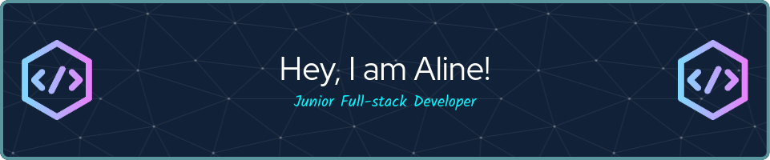

## Hello, world! Welcome to my profile 

:computer: Junior Full-Stack Web Developer

:ballot_box_with_check: Open to work

## :wrench: Tech Stack:

<!-- Languages -->

<!--  -->

<!--  -->

<!-- Version control -->

<!-- Hosting -->
<!--  -->
<!--  -->
<!--  -->

<!-- IDEs/Editors -->
<!--  -->

<!--  -->

:link:  You can also find me here:

&nbsp;

<!--
**alinebellozo/alinebellozo** is a ✨ _special_ ✨ repository because its `README.md` (this file) appears on your GitHub profile.

Here are some ideas to get you started:

- 🔭 I’m currently working on ...
- 🌱 I’m currently learning ...
- 👯 I’m looking to collaborate on ...
- 🤔 I’m looking for help with ...
- 💬 Ask me about ...
- 📫 How to reach me: ...
- 😄 Pronouns: ...
- ⚡ Fun fact: ...
-->
